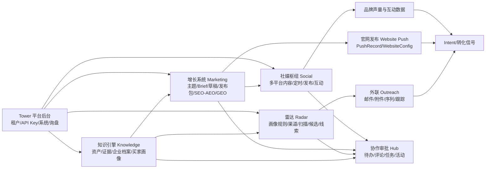

# VertaX 架构与业务地图

> **本文档是团队对 VertaX 系统的共识性理解，所有新成员入职必读。**

---

## 一句话定义

**VertaX 是一套以企业知识为底座、同时驱动主动获客和内容增长，并通过协作与平台治理形成闭环的多租户增长操作系统。**

> 这不是"几个后台页面的集合"，而是一个完整的智能增长系统。

---

## 业务地图



---

## 1. 模块职责

### 1.1 Knowledge Engine · 知识引擎（系统底座）

**定位**：Source of Truth - 企业知识的唯一真实来源

**核心职责**：
- 沉淀企业资料、证据、品牌规范
- 构建企业档案（CompanyProfile）
- 定义买家画像（Persona）
- 为 AI 能力提供前置条件和知识底座

**关键数据模型**：
- `Asset` / `AssetChunk` - 企业资产与分块
- `Evidence` - 业务证据
- `BrandGuideline` - 品牌规范
- `CompanyProfile` - 企业档案
- `Persona` - 买家画像

**为什么重要**：
> Knowledge 不是附属模块，而是整个系统的基础。没有知识沉淀，Radar 和 Marketing 就是无源之水。

**相关文件**：
- [src/config/nav.ts](/D:/vertax/src/config/nav.ts)
- [prisma/schema.prisma](/D:/vertax/prisma/schema.prisma)

---

### 1.2 Radar · 获客雷达（主动获客引擎）

**定位**：Outbound Growth Engine - 主动发现并触达目标客户

**核心流程**：
```
画像规则 → 数据源/渠道 → 持续扫描 → 候选分层 → 导入线索 → 外联跟进
```

**关键数据模型**：
- `RadarSearchProfile` - 获客画像配置
- `RadarCandidate` - 候选公司
- `ProspectCompany` / `ProspectContact` - 潜在客户与联系人
- `Opportunity` - 商机
- `OutreachRecord` - 外联记录

**相关文件**：
- [src/lib/radar/pipeline.ts](/D:/vertax/src/lib/radar/pipeline.ts)

---

### 1.3 Marketing · 增长系统（内容增长引擎）

**定位**：Inbound Growth Engine - 通过内容吸引高意向客户

**核心流程**：
```
主题集群 → Brief → 草稿 → 证据校验 → 发布包 → SEO/AEO/GEO
```

**关键数据模型**：
- `TopicCluster` - 主题集群
- `ContentBrief` - 内容简报
- `SeoContent` - SEO 内容
- `ArtifactVersion` - 内容版本
- `PublishPack` - 发布包

**相关文件**：
- [src/lib/marketing/growth-pipeline.ts](/D:/vertax/src/lib/marketing/growth-pipeline.ts)

---

### 1.4 Social · 声量枢纽（社媒分发层）

**定位**：Social Distribution - 多平台内容分发与互动沉淀

**核心职责**：
- 将内容库资产转换为多平台帖子
- 定时发布、账号授权管理
- 互动数据沉淀（点赞、评论、分享）

**关键数据模型**：
- `SocialPost` / `PostVersion` - 社媒帖子与版本
- `SocialAccount` - 社媒账号

**相关文件**：
- [src/app/customer/social/page.tsx](/D:/vertax/src/app/customer/social/page.tsx)

---

### 1.5 Hub · 协作审批（执行协调层）

**定位**：Collaboration Hub - 跨模块协同与任务管理

**核心职责**：
- 聚合待办、评论、任务、活动
- 模块健康度监控
- 不生产业务数据，只做连接和协调

**关键数据模型**：
- `Todo` / `Comment` / `Task` - 待办、评论、任务
- `Activity` - 活动记录

**相关文件**：
- [src/actions/hub.ts](/D:/vertax/src/actions/hub.ts)
- [src/app/customer/hub/page.tsx](/D:/vertax/src/app/customer/hub/page.tsx)

---

### 1.6 Tower · 平台后台（平台治理层）

**定位**：Platform Governance - 多租户系统的治理中枢

**核心职责**：
- 租户管理（创建、配置、权限）
- API Key 管理
- 系统配置
- 询盘管理

**相关文件**：
- [src/app/(tower)/tower/page.tsx](/D:/vertax/src/app/(tower)/tower/page.tsx)

---

## 2. 数据流主链

### 2.1 知识流（Knowledge Flow）
```
Asset / AssetChunk / Evidence
  → BrandGuideline
  → CompanyProfile / Persona
```
**作用**：构建企业知识底座，为所有 AI 能力提供依据。

---

### 2.2 获客流（Acquisition Flow）
```
CompanyProfile / Persona（画像依据）
  → RadarSearchProfile（获客配置）
  → RadarCandidate（候选发现）
  → ProspectCompany / ProspectContact（客户与联系人）
  → Opportunity（商机）
  → OutreachRecord（外联跟进）
```
**作用**：从画像到线索，从线索到商机的完整获客链路。

---

### 2.3 内容流（Content Flow）
```
Knowledge Base（知识底座）
  → TopicCluster（主题规划）
  → ContentBrief（内容简报）
  → SeoContent（内容生成）
  → ArtifactVersion（版本管理）
  → PublishPack（发布包）
```
**作用**：从知识到内容的生产链路，支撑 SEO/AEO/GEO。

---

### 2.4 发布流（Publishing Flow）
```
SeoContent
  → WebsiteConfig（官网配置）
  → PushRecord（推送记录）
```
**作用**：将内容推送到外部站点，实现内容分发。

**相关文件**：
- [src/actions/publishing.ts](/D:/vertax/src/actions/publishing.ts)

---

### 2.5 社媒流（Social Flow）
```
Content Library / Manual Topic
  → SocialPost / PostVersion
  → SocialAccount（账号授权）
  → 互动指标沉淀
```
**作用**：多平台内容分发与互动管理。

---

### 2.6 回流信号（Feedback Loop）
```
邮件打开/点击
网站访问
内容引用
社媒互动
  → IntentSignal（意图信号）
  → Notification（通知）
  → Activity（活动记录）
```
**作用**：将用户行为转化为经营信号，反哺知识底座和获客策略。

---

## 3. 用户流（User Journey）

### 3.1 客户决策者（Executive）
```
登录 → 决策中心（Dashboard）
  → 查看 AI 简报、待办、模块健康
  → 跳转到具体模块处理
```
**核心诉求**：掌控全局，快速决策。

**相关文件**：
- [src/app/customer/home/page.tsx](/D:/vertax/src/app/customer/home/page.tsx)

---

### 3.2 获客运营（Acquisition Operator）
```
1. 补全 Knowledge 的企业档案/买家画像
2. 配置 Radar 任务和渠道
3. 处理候选公司，导入线索
4. 生成外联内容并触达
```
**核心诉求**：高效发现高价值客户，提升回复率。

---

### 3.3 内容运营（Content Operator）
```
1. 从 Knowledge 补充证据与品牌规范
2. 在 Marketing 做主题规划
3. 生成 Content Brief
4. AI 生成内容并校验
5. 推送到官网
6. 跟踪 GEO 引用情况
```
**核心诉求**：持续产出高质量内容，提升搜索可见度。

---

### 3.4 社媒运营（Social Operator）
```
1. 从内容库导入或手工输入主题
2. 在 Social 生成各平台版本
3. 定时或立即发布
4. 监控互动数据
```
**核心诉求**：多平台协同，提升品牌声量。

---

### 3.5 平台管理员（Platform Admin）
```
在 Tower 管理：
- 租户账号
- 系统配置
- API Key
- 询盘分发
```
**核心诉求**：系统稳定，租户满意。

---

## 4. 核心关系图谱

### 4.1 知识驱动获客
```
Knowledge（画像与企业档案）
  → 决定 Radar 获客质量
```
**洞察**：没有精准的画像，获客就是大海捞针。

---

### 4.2 知识驱动内容
```
Knowledge（证据与品牌规范）
  → 决定 Marketing 内容质量
```
**洞察**：没有企业专属知识，AI 生成的内容就是泛泛而谈。

---

### 4.3 内容驱动分发
```
Marketing（内容资产）
  → 官网发布（Website Push）
  → 社媒分发（Social）
```
**洞察**：内容是官网与社媒的共同燃料。

---

### 4.4 获客形成闭环
```
Radar（线索发现）
  → Outreach（外联触达）
  → Intent Signal（转化信号）
```
**洞察**：线索不是终点，外联与信号跟踪才形成闭环。

---

### 4.5 Hub 的横向价值
```
Hub 观察所有模块：
- Knowledge → 知识健康度
- Radar → 获客进度
- Marketing → 内容产出
- Social → 互动数据
  → 聚合为待办、任务、活动
```
**洞察**：Hub 不替代任何模块，但让所有模块协同工作。

---

## 5. 系统架构总结

### 5.1 真正的"主数据"是什么？

> **不是帖子，不是线索，而是企业知识。**

- 帖子会过时，线索会失效
- 但企业知识（产品、资质、案例、客户画像）是可持续复用的资产
- 知识越沉淀，系统越智能

---

### 5.2 模块分层模型

```
┌─────────────────────────────────────────┐
│         Tower（平台治理层）              │
│    租户 / API Key / 系统 / 询盘           │
└─────────────────────────────────────────┘
                    ↓
┌─────────────────────────────────────────┐
│       Knowledge（知识底座层）             │
│   资产 / 证据 / 企业档案 / 买家画像        │
└─────────────────────────────────────────┘
                    ↓
┌──────────────┬──────────────┬──────────┐
│   Radar      │  Marketing   │  Social  │
│ （生产引擎）  │ （生产引擎）  │（分发层） │
└──────────────┴──────────────┴──────────
                    ↓
┌─────────────────────────────────────────┐
│          Hub（执行协调层）               │
│      待办 / 评论 / 任务 / 活动            │
└─────────────────────────────────────────┘
```

---

### 5.3 增长飞轮（Growth Flywheel）

```
Knowledge（知识沉淀）
    ↓
Radar + Marketing（双引擎驱动）
    ↓
Social + Publishing（分发放大）
    ↓
Intent Signal（信号回流）
    ↓
优化 Knowledge（知识迭代）
    ↓
【飞轮加速】
```

**洞察**：这是一个自我强化的增长飞轮，知识越丰富，获客越精准，内容越优质，信号越丰富，知识越完善。

---

## 6. 技术实现原则

### 6.1 知识优先（Knowledge First）
- 所有 AI 能力必须基于企业知识库
- 不允许脱离知识底座生成内容
- 知识更新必须可追溯、可版本化

### 6.2 管道化架构（Pipeline Architecture）
- 每个模块都是独立的 Pipeline
- 模块之间通过标准接口通信
- 支持灵活组合和扩展

### 6.3 信号驱动（Signal-Driven）
- 所有用户行为都转化为信号
- 信号反哺知识和策略
- 形成数据闭环

### 6.4 多租户隔离（Multi-tenant Isolation）
- 租户数据严格隔离
- 知识底座独立，互不干扰
- Tower 统一治理

---

## 7. 常见问题（FAQ）

### Q1：为什么 Knowledge 是独立的模块，而不是附属功能？
**A**：因为 Knowledge 是整个系统的 Source of Truth。没有知识沉淀，AI 能力就是无源之水。将 Knowledge 独立，是为了强调其战略地位。

### Q2：Radar 和 Marketing 的区别是什么？
**A**：
- Radar 是 Outbound（主动获客）：找客户
- Marketing 是 Inbound（内容获客）：让客户找你
- 两者都依赖 Knowledge 提供的知识底座

### Q3：Hub 的价值是什么？它好像不生产业务数据？
**A**：Hub 的价值在于**连接和协调**。它不生产数据，但它让所有模块的数据产生协同价值。就像神经系统，不生产能量，但协调全身。

### Q4：Tower 和 Hub 的区别？
**A**：
- Tower 是平台治理（面向平台方）
- Hub 是执行协调（面向租户）
- Tower 管租户，Hub 管任务

---

## 8. 文档维护

**最后更新**：2026-04-08

**维护者**：VertaX 技术团队

**更新原则**：
- 模块职责变化时更新
- 数据模型重大调整时更新
- 用户流程优化时更新

---

## 附录：关键代码索引

| 模块 | 核心文件 | 说明 |
|------|----------|------|
| Knowledge | `prisma/schema.prisma` | 数据模型定义 |
| Radar | `src/lib/radar/pipeline.ts` | 获客管道 |
| Marketing | `src/lib/marketing/growth-pipeline.ts` | 增长管道 |
| Social | `src/app/customer/social/page.tsx` | 社媒页面 |
| Hub | `src/actions/hub.ts` | 协作动作 |
| Publishing | `src/actions/publishing.ts` | 发布动作 |
| Tower | `src/app/(tower)/tower/page.tsx` | 平台后台 |

---

**END**
